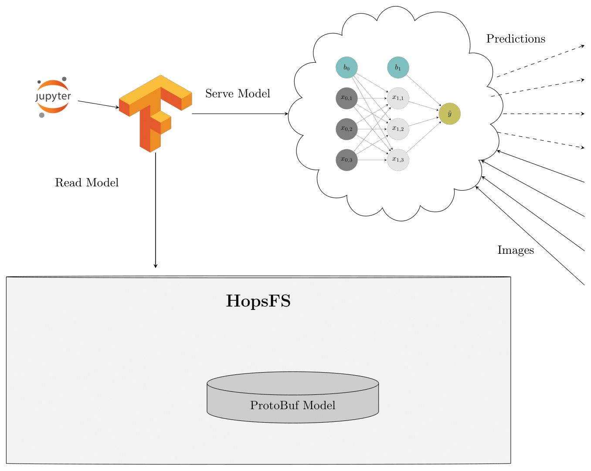

# End-to-End Distributed Deep Learning Pipeline on Hops

The notebooks assumes that you have downloaded the TinyImageNet dataset

- You can download the dataset from [here](https://tiny-imagenet.herokuapp.com/)
- Unzip the dataset in your project root
- You can also reuse an existing dataset with the TinyImageNet by sharing it across projects at hops.site
- The same pipeline can also be used for training on the larger ImageNet dataset, you just need to change the dimensions in from 64x64x3 images to 224x224x3 and make sure that you have a similar directory layout

===

## Step 1: Parse the Raw Dataset, join Features with Labels, Save to FeatureStore

[Step1_Notebook](./Step1_Save_to_Featurestore.ipynb)

## Step 2: Single Machine Training Using Distributed Hyperparameter Search and Model Iteration using Reproducible Experiments

[Step2_Notebook](./Step2_Model_Training_Parallel_Experiments.ipynb)

## Step 3: Multiple GPU Training Using the Ring-All-Reduce Architecture

[Step3_Notebook](./Step3_Ring_AllReduce_GPU_Training.ipynb)

## Step 4: Model Serving

[Step4_Notebook](./Step4_Model_Serving.ipynb)

